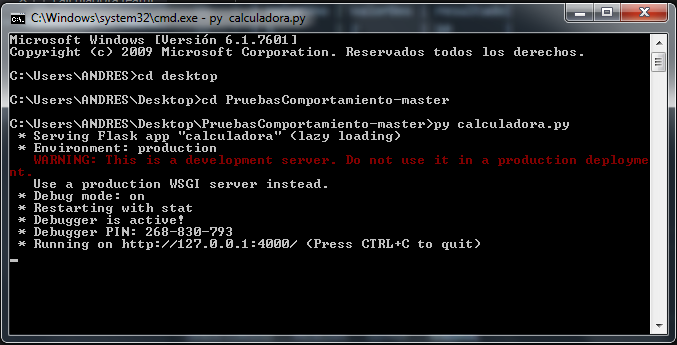
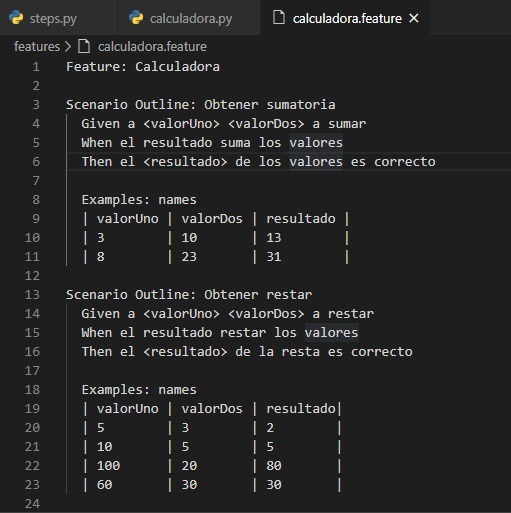
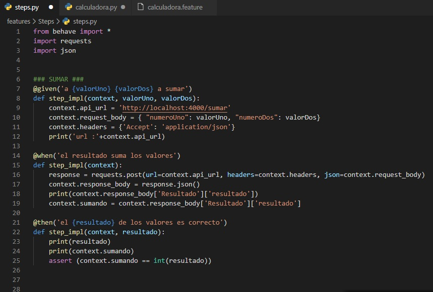
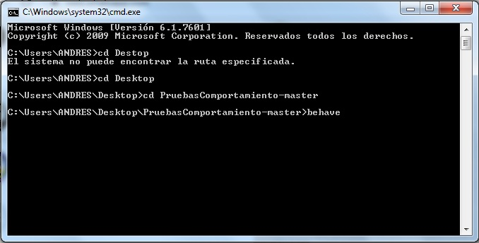
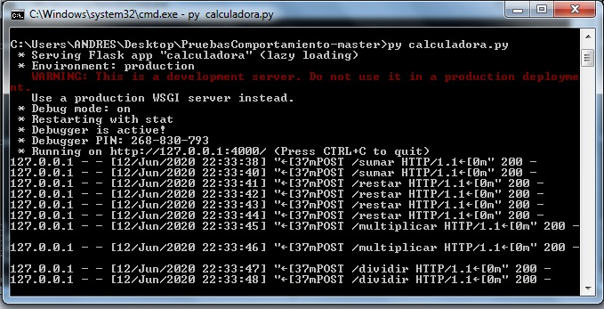
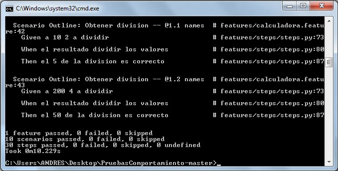

### Integrantes: 

Julio Cesar Reina      20201099045

Cristian Gonzalez   20201099032

Andres Lozano          20201099038

# Pruebas de Comportamiento

## Behavior Driven Development (BDD)
El desarrollo impulsado por el comportamiento es una técnica que surge a raíz del TDD (Test Driven Development). Se basa en que es necesario hacer tests que sirvan para describir las especificaciones en un lenguaje que puedar una persona que no sepa de programación, permitiendo asi que pueda haber alguien de producto, que defina las especificaciones que a su vez son tests de aceptación.

El lenguaje más usado en esta tecnica es Gherkin, cuya base son las sentencias Given, When y Then. Con Given debemos añadir todos los pasos necesarios para llegar hasta el punto donde queremos realizar el test. En When realizamos un estímulo, lo que se prueba. Idealmente sería una única sentencia. Con Then comprobamos que el resultado del estímulo es el esperado.

## Behave 
Behave es un framework para el desarrollo basado en comportamientos, se basa en python y actualmente es una de las implementaciones mas usadas en la aplicacion del lenguaje Gherkin. Este utiliza pruebas escritas en lenguaje natural, respaldadas por código Python. Se puede decir que se trata de un clon de Cucumber implementado para Python. Para su tilizacion se usan features donde creamos la test suite para verificar un requerimiento determinado. El archivo .feature contiene escenarios donde definimos los pasos Given->When->Then para verificar los criterios de aceptación de la funcionalidad en desarrollo.

# Pruebas de funcionamiento de la implementación 

## Servicio Web
Creación del servicio Web

Implementacion del servicio web desarrollado con flask 

## Implementacion del framework Behave

Definicion de los casos de prueba en el archivo .feature

## Configuracion de los pasos (sentencias Given->When->Then)

## Validacion del funcionamiento del framework 

Ejecución del proceso

Peticiones realizadas al servicio web durante la ejcucion de la prueba

Resultados de la prueba

